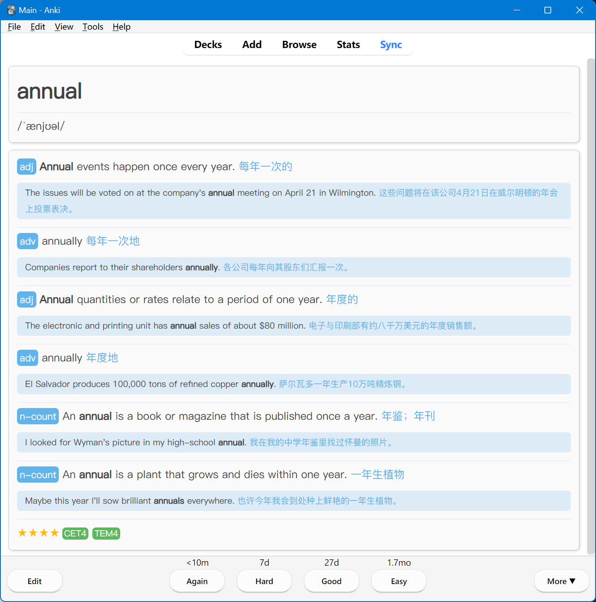
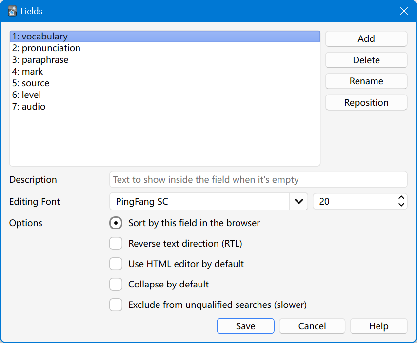
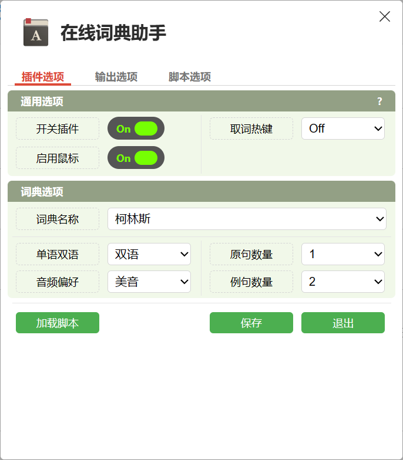
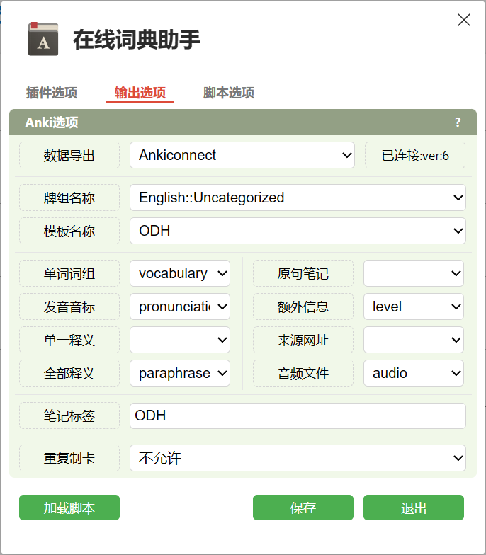
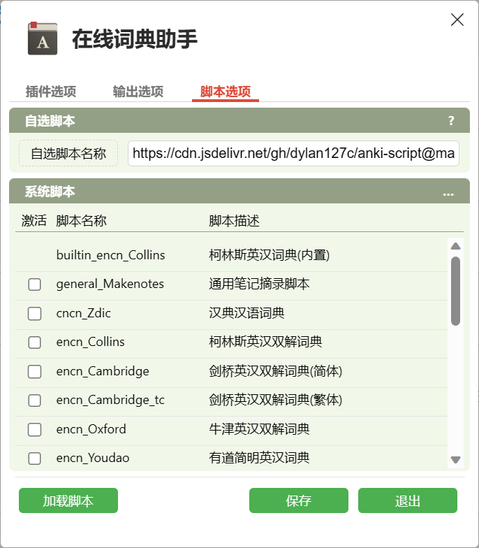

# anki-script

本仓库用于存储适用于 [Online Dictionary Helper](https://github.com/ninja33/ODH) 的自选脚本，该脚本可以在使用 ODH 插件制卡时，提供更为规范的代码格式。

国内推荐使用 CDN 加速：

- 柯林斯词典：https://cdn.jsdelivr.net/gh/dylan127c/anki-script@main/encn_Collins.js
- 剑桥词典：https://cdn.jsdelivr.net/gh/dylan127c/anki-script@main/encn_Cambridge.js

效果演示：

脚本对应的在线词典名称：

| dictionary script |    dictionary name     |
| :---------------: | :--------------------: |
|  encn_Collins.js  |         柯林斯         |
| encn_Cambridge.js | 剑桥(简体)、劍橋(簡體) |

其他说明：

|           file            |                         description                          |
| :-----------------------: | :----------------------------------------------------------: |
| http_service_for_test.bat | 已部署 [Node.js](https://nodejs.org/en) 的情况下，可以使用此 BAT 脚本开启本地服务器，以测试词典脚本的具体表现 |
|     mark_format.html      | 存储 ODH 中主要使用的 HTML、CSS 代码，可在自定义额外的 Anki Field 时使用 |
|        card types         |                 Anki 内的具体 ODH 牌组的配置                 |

Anki 内的牌组域设置：

[Online Dictionary Helper](https://github.com/ninja33/ODH) 插件设置：

